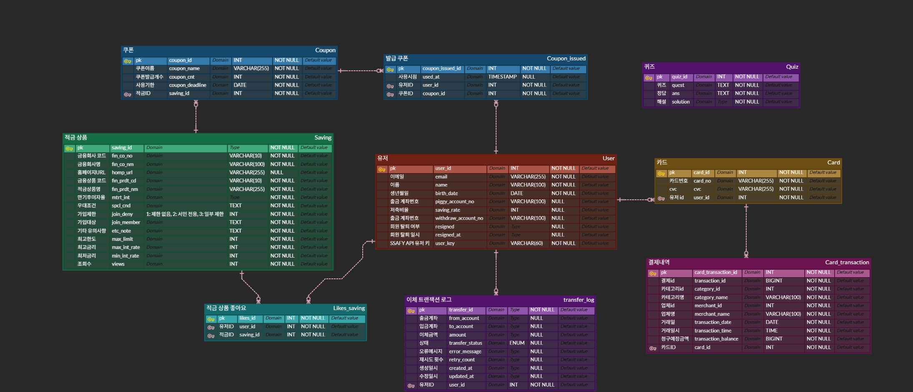
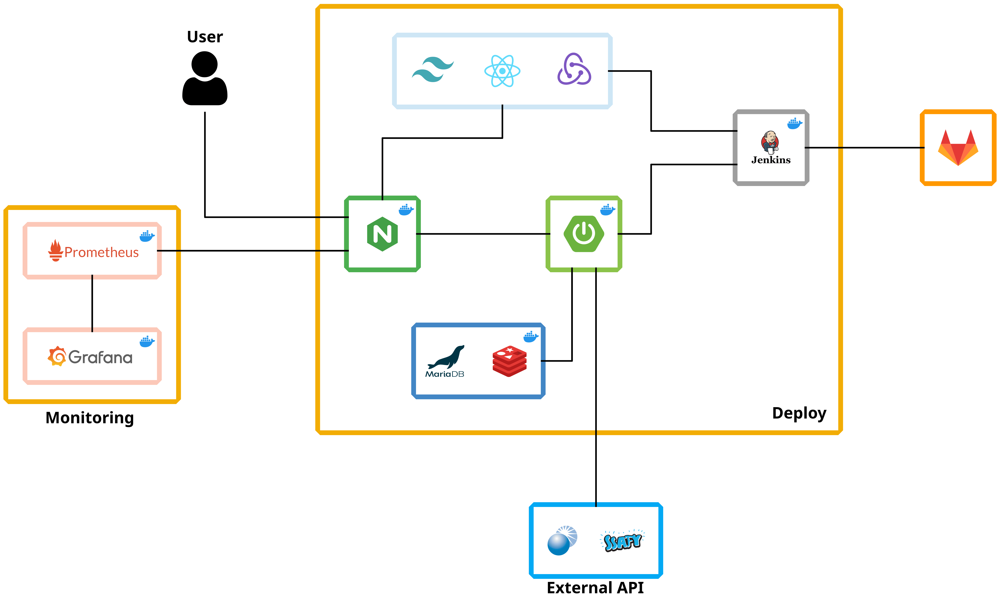

# 🐷 쓰면서 담는 새로운 저축, 쓰담 🐷

 

이 프로젝트는 2025년 2월 부터 4월 까지 진행된 `삼성 청년 소프트웨어 아카데미(Samsung Software Academy For Youth, SSAFY)` 12기 2학기 특화 프로젝트 산출물 입니다.

 

## 🎬 소개 영상

 

## 🛠️ 기술 스택

## Server

## Client

## Database

## Infra

## Version Control & Tools

 

## 👤 팀원 정보 및 업무 분담 내역

### 프론트엔드 (Front-end)

|   Name   | 이예원              |
| :------: | ------------------- |
| Profile  |
| Position | 본인 포지션 작성    |
|   Git    | 본인 깃헙 주소 작성 |
|  E-mail  | 본인 이메일 작성    |

 

<h4>프론트엔드 역할 및 담당 소개</h4>

`이예원`

 

### 풀스택 (Full-stack)

|   Name   | 안정길                                                                                                                                       | 이시호                                                                                                                                    |
| :------: | -------------------------------------------------------------------------------------------------------------------------------------------- | ----------------------------------------------------------------------------------------------------------------------------------------- |
| Profile  | 

 | 

 |
| Position | Full-Stack Developer                                                                                                                         | Full-Stack Developer                                                                                                                      |
|   Git    | [@JeongnggilAhn](https://github.com/JeonggilAhn/)                                                                                            | [@harimau97](https://github.com/harimau97)                                                                                                |
|  E-mail  | junggilahn.dev@gmail.com                                                                                                                     | harimauho@gmail.com                                                                                                                       |

 

<h4>풀스택 역할 및 담당 소개</h4>

`안정길`
 
- 유사도 검색 커스터마이징
  - 레벤슈타인 거리 기반 한영매칭, 글자 분해로 커스텀 검색 로직 작성
- FE 성능 최적화  
  - `React.memo`, `useCallback`, `useRef`으로 불필요한 렌더링을 줄여 최적화하여 렌더링 시간 88.6% 단축 (31.6ms -> 3.6ms)
  - `IntersectionObserver`를 활용한 무한 스크롤 및 Skeleton UI 적용
- 서비스 메인 페이지 설계 및 디자인 구현
   
`이시호`
 
- 개인정보 암호화 기능 구현
  - RSA + AES256 하이브리드 방식을 적용
  - 프론트에서 암호화한 정보를 서버로 전송하고, 서버에서 필요한 경우 복호화하여 사용할 수 있도록 구현
- AI를 이용한 금융 퀴즈 생성 및 DB 저장 
  - Google Cloud에서 Gemini-2.0-flash 모델을 호출하여 사용
  - 스케쥴러를 통해 일주일 중 특정 시간에 자동으로 퀴즈를 생성하고 DB에 저장하는 방식으로 구현
- 서비스 메인 페이지 설계 및 디자인 구현

 

### 백엔드 (Back-end)

|   Name   | 조현석                       | 최휘준                       |
| :------: | ---------------------------- | ---------------------------- |
| Profile  | 본인 깃헙 프로필 이미지 주소 | 본인 깃헙 프로필 이미지 주소 |
| Position | 본인 포지션 작성             | 본인 포지션 작성             |
|   Git    | 본인 깃헙 주소 작성          | 본인 깃헙 주소 작성          |
|  E-mail  | 본인 이메일 작성             | 본인 이메일 작성             |

 

<h4>백엔드 역할 및 담당 소개</h4>

`조현석`

`최휘준`

 

### 인프라 (Infra)

|   Name   | 이승연                       |
| :------: | ---------------------------- |
| Profile  | 본인 깃헙 프로필 이미지 주소 |
| Position | 본인 포지션 작성             |
|   Git    | 본인 깃헙 주소 작성          |
|  E-mail  | 본인 이메일 작성             |

 

<h4>인프라 역할 및 담당 소개</h4>

`이승연`

 

## 📊 데이터베이스 모델링 (ERD)

 

## 📜 프로젝트 구조

## 🔧 구현 목표 및 실제 구현도

 

## 🚀 기술적 설명

### 메인 페이지

<table border="1">
  <thead>
    <tr>
      <th>카드 등록</th>
      <th>결제 내역 확인 및 저축 비율 설정</th>
    </tr>
  </thead>
  <tbody>
    <tr>
      <td>
        
      </td>
      <td>
        
      </td>
    </tr>
  </tbody>
</table>

### 적금

<table border="1">
  <thead>
    <tr>
      <th>적금 상품 검색</th>
      <th>검색 결과 페이지네이션</th>
    </tr>
  </thead>
  <tbody>
    <tr>
      <td>
        
      </td>
      <td>
        
      </td>
    </tr>
  </tbody>
</table>

### 출금 퀴즈

<table border="1">
  <thead>
    <tr>
      <th>퀴즈 풀이 및 해설</th>
    </tr>
  </thead>
  <tbody>
    <tr>
      <td>
        
      </td>
    </tr>
  </tbody>
</table>

### 쿠폰

<table border="1">
  <thead>
    <tr>
      <th>발급 및 대기열 표시</th>
      <th>사용</th>
    </tr>
  </thead>
  <tbody>
    <tr>
      <td>
        
      </td>
      <td>
        
      </td>
    </tr>
  </tbody>
</table>

 

## 🔑 트러블 슈팅 : 문제 및 해결 방법

### 1. SSE 관련 이슈

